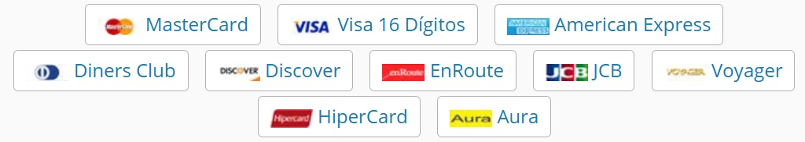

[\[English\]](../README.md) [\[Português\]](#CardFlagIdentifier)
_______________________________________________________________________________________________________________________________________
# CardFlagIdentifier
# Web API - Identifica Bandeira do Cartão de Crédito

Este projeto é uma Web API desenvolvida em .NET que recebe um número de cartão de crédito e retorna a bandeira correspondente.

## Tecnologias Utilizadas

- .NET 9 
- ASP.NET Core Web API
- Swagger para documentação

## Como Executar o Projeto

### Pré-requisitos

Certifique-se de ter instalado:

- [SDK do .NET](https://dotnet.microsoft.com/download)
- [Git](https://git-scm.com/)

### Clonar o Repositório

```sh
git clone https://github.com/G10van1/CardFlagIdentifier
cd CardFlagIdentifier
```

### Restaurar Dependências

```sh
dotnet restore
```

### Executar a API

```sh
dotnet run
```

A API estará disponível em `https://localhost:44343`

## Endpoints Disponíveis

### Verifica Bandeira do Cartão

**Endpoint:** `GET /cardflag/{card number}`

**Request Body:**

```json
{
  "numeroCartao": "4111111111111111"
}
```

**Response:**

```json
{
  "flag": "Visa"
}
```
## Cartões Reconhecidos




## Contribuição

1. Fork o repositório.
2. Crie uma branch com sua feature: `git checkout -b minha-feature`
3. Commite suas alterações: `git commit -m 'Adiciona nova funcionalidade'`
4. Envie para a branch principal: `git push origin minha-feature`
5. Abra um Pull Request.

## Licença

Este projeto está sob a licença MIT.
